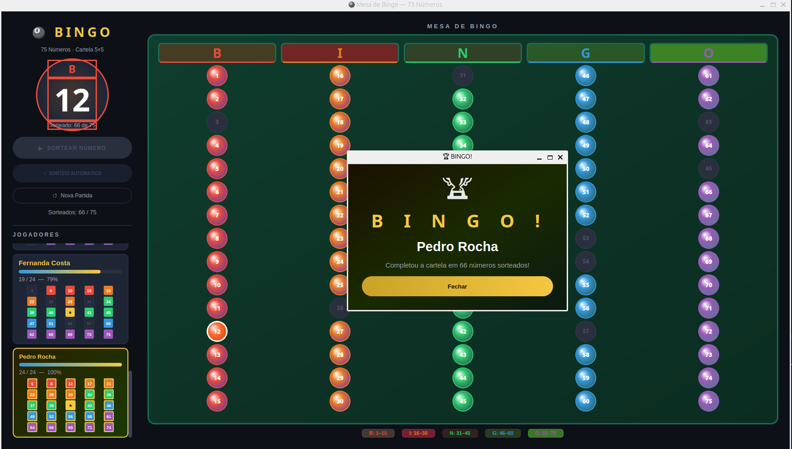
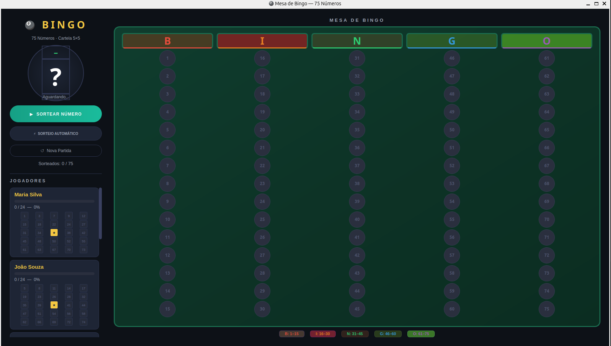
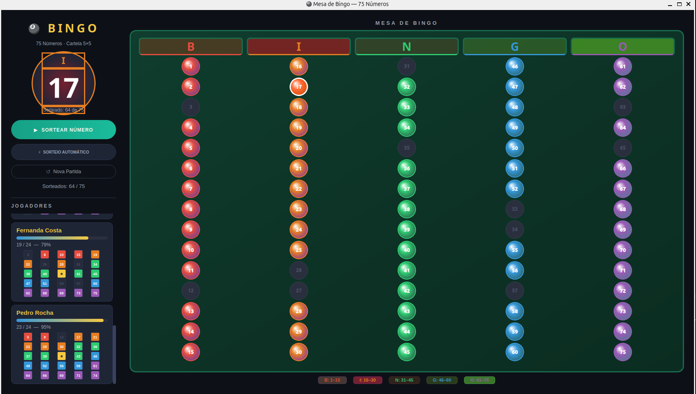

# 🎱 Bingo 75 — Sistema Profissional em Python



Um sistema completo e elegante para gerenciamento de sorteios de Bingo de 75 bolas, desenvolvido com **Python**, **PyQt5** para uma interface gráfica moderna e **SQLAlchemy** para persistência robusta de dados em SQLite.

---

## 🚀 Funcionalidades Principais

- **Mesa de Bingo Inteligente**: Visualização em tempo real das 75 bolas organizadas pelas colunas B-I-N-G-O, com destaques cromáticos por categoria.
- **Sorteio Híbrido**: Suporte para sorteio manual ou modo automático com intervalo configurável.
- **Cards de Jogadores Dinâmicos**: Acompanhamento individual de cada cartela com barras de progresso de acerto e mini-visualização 5x5.
- **Detecção Automática de Vencedor**: Sistema inteligente que identifica o fechamento da cartela e destaca o vencedor com efeitos visuais.
- **Histórico e Auditoria**: Registro completo de partidas, números sorteados e desempenho dos jogadores via SQLite.

---

## 📽️ Demonstração em Vídeo

Confira o sistema em operação:

https://github.com/LuizIwasaki/bing-app-complete/raw/main/images/funcionamento-bingo.webm

---

## 📸 Galeria do Sistema

<div align="center">
  
  
</div>

---

## 🛠️ Tecnologias Utilizadas

- **Linguagem**: [Python 3.x](https://www.python.org/)
- **Interface Gráfica (GUI)**: [PyQt5](https://www.riverbankcomputing.com/software/pyqt/)
- **Banco de Dados (ORM)**: [SQLAlchemy](https://www.sqlalchemy.org/)
- **Armazenamento**: SQLite (Local e leve)

---

## 📦 Instalação e Execução

1. **Clone o repositório**:
   ```bash
   git clone https://github.com/LuizIwasaki/bing-app-complete.git
   cd bing-app-complete
   ```

2. **Instale as dependências**:
   ```bash
   pip install -r requirements.txt
   ```

3. **Inicie o sistema**:
   ```bash
   python main.py
   ```

---

## 📄 Configuração de Cartelas (`CARTELAS.TXT`)

O sistema carrega os jogadores e suas respectivas cartelas a partir de um arquivo de texto simples. 

**Regras de Formatação:**
- Cada linha representa um jogador: `Nome do Jogador: n1,n2,...,n24`
- Exatamente **24 números** únicos.
- Intervalo permitido: **1 a 75**.

**Exemplo:**
```text
João Silva: 1,15,30,45,60,75,2,14,29,44,59,74,3,13,28,43,58,73,4,12,27,42,57,72
```

---

## 🗄️ Estrutura de Dados

O banco `bingo.db` gerencia três entidades principais para garantir a integridade dos jogos:

| Tabela | Responsabilidade |
| :--- | :--- |
| **Partidas** | Armazena timestamps e o vencedor final. |
| **Jogadores** | Registra as cartelas e o status de cada participante. |
| **Números Sorteados** | Mantém a ordem exata do globo de sorteio. |

---

## 🎨 Personalização

### Velocidade do Automático
Ajuste o delay do sorteio no arquivo `main.py`:
```python
self.timer_sorteio.start(2000)  # Valor em milissegundos
```

### Cores das Colunas
O sistema utiliza uma paleta vibrante para facilitar a leitura:
- **B**: Vermelho | **I**: Laranja | **N**: Verde | **G**: Azul | **O**: Roxo

---

<p align="center">Desenvolvido com ❤️ por <a href="https://github.com/LuizIwasaki">LuizIwasaki</a></p>
